# Flujo del Sistema de Locaciones

Este documento describe el flujo completo del sistema de locaciones desde la inicialización hasta la interacción en tiempo real.

## 🚀 1. Inicialización del Sistema

```mermaid
graph TD
    A[Servidor Inicia] --> B[Crear GameState]
    B --> C[Crear Room 'main']
    C --> D[Inicializar LocationManager]
    D --> E[Crear Locaciones Predefinidas]
    E --> F[Racing Zone]
    E --> G[Social Hub]
    E --> H[City Center]
    F --> I[Iniciar Loop de Física]
    G --> I
    H --> I
    I --> J[Sistema Listo]
```



### Código de Inicialización
```typescript
// 1. Se crea la room principal
const mainRoom: IRoom = {
  id: "main",
  name: "Main Room",
  players: {},
  vehicles: {},
  locations: {}, // ← Locaciones vacías inicialmente
  maxPlayers: 1000,
  createdAt: new Date(),
};

// 2. Se inicializa LocationManager
const locationManager = new LocationManager(gameState);

// 3. Se crean locaciones predefinidas
const racingLocation = locationManager.createLocation("main", "Racing Zone", "racing", {
  bounds: { min: { x: 200, y: 0, z: 150 }, max: { x: 300, y: 50, z: 250 } }
});
```

---

## 👤 2. Player Se Conecta

```mermaid
sequenceDiagram
    participant C as Cliente
    participant S as Servidor
    participant GM as GameState
    participant RM as RoomManager
    participant LM as LocationManager

    C->>S: WebSocket Connect
    S->>GM: Crear Player
    S->>RM: Agregar Player a Room 'main'
    RM->>GM: Player.currentRoom = 'main'
    S->>C: Confirmación de Conexión
    
    Note over S: Player está en room pero sin locación específica
    Note over S: currentLocation = undefined
```



### Estados del Player
```typescript
// Al conectarse
player = {
  id: "player123",
  position: { x: 0, y: 0, z: 0 },
  currentRoom: "main",        // ← Asignado inmediatamente
  currentLocation: undefined  // ← Sin locación específica
}
```

---

## 🏃‍♂️ 3. Player Se Mueve (Asignación Automática)


### Lógica de Bounds
```typescript
// Verificación de bounds cada 0.5 segundos
function checkPlayerInLocationBounds(playerId: string, locationId: string): boolean {
  const location = getLocation(locationId);
  const player = gameState.players[playerId];
  
  const pos = player.position;
  const bounds = location.bounds;
  
  return (
    pos.x >= bounds.min.x && pos.x <= bounds.max.x &&
    pos.y >= bounds.min.y && pos.y <= bounds.max.y &&
    pos.z >= bounds.min.z && pos.z <= bounds.max.z
  );
}
```

---

## 📱 4. Cliente Solicita Información


### Mensajes WebSocket

#### Request: Obtener Locaciones
```json
{
  "type": "get_room_locations",
  "data": { "roomId": "main" }
}
```

#### Response: Lista de Locaciones
```json
{
  "type": "room_locations",
  "data": {
    "roomId": "main",
    "locations": [
      {
        "id": "racing-zone-id",
        "name": "Racing Zone",
        "type": "racing",
        "playerCount": 5,
        "maxPlayers": 50,
        "isActive": true
      }
    ]
  }
}
```

---

## 🎮 5. Unirse Manualmente a Locación


### Validaciones
```typescript
// Verificaciones antes de mover player
function movePlayerToLocation(playerId: string, locationId: string): boolean {
  const location = getLocation(locationId);
  const player = gameState.players[playerId];

  // 1. Verificar que existan
  if (!location || !player) return false;
  
  // 2. Verificar capacidad
  if (Object.keys(location.players).length >= location.maxPlayers) return false;
  
  // 3. Verificar que esté en la room correcta
  if (player.currentRoom !== location.roomId) return false;
  
  // 4. Proceder con el movimiento
  // ...
}
```

---

## 📡 6. Broadcast de Cambios

```mermaid
graph TD
    A[Player Cambia Locación] --> B[LocationManager.notifyLocationChange()]
    B --> C[broadcastLocationUpdate()]
    C --> D{Obtener Players en Room}
    D --> E[Player 1]
    D --> F[Player 2]
    D --> G[Player N]
    E --> H[WebSocket Send]
    F --> H
    G --> H
    H --> I[Clientes Reciben location_update]
```

### Mensaje de Broadcast
```json
{
  "type": "location_update",
  "data": {
    "id": "racing-zone-id",
    "name": "Racing Zone",
    "type": "racing",
    "players": [
      {
        "id": "player123",
        "position": { "x": 250, "y": 10, "z": 200 },
        "rotation": { "x": 0, "y": 0, "z": 0, "w": 1 }
      }
    ],
    "vehicles": [],
    "playerCount": 1,
    "vehicleCount": 0,
    "maxPlayers": 50,
    "isActive": true
  }
}
```

---

## 🏁 7. Ejemplo: Evento de Carrera

```mermaid
sequenceDiagram
    participant A as Admin/Sistema
    participant LM as LocationManager
    participant P1 as Player 1
    participant P2 as Player 2
    participant B as Broadcaster

    A->>LM: createLocation("Race Track", "racing")
    LM->>B: Nueva locación creada
    
    P1->>LM: Entra al área (automático)
    LM->>P1: currentLocation = "race-track-id"
    LM->>B: broadcastLocationUpdate()
    
    P2->>LM: Entra al área (automático)
    LM->>P2: currentLocation = "race-track-id"
    LM->>B: broadcastLocationUpdate()
    
    A->>A: Detectar 2+ players en racing
    A->>B: Broadcast "race_starting"
    B->>P1: race_starting event
    B->>P2: race_starting event
    
    Note over A: Iniciar lógica de carrera
```



### Código del Evento
```typescript
function startRaceEvent() {
  const locations = locationManager.getRoomLocations("main");
  const racingLocation = Object.values(locations).find(loc => loc.type === "racing");
  
  const playersInRacing = Object.keys(racingLocation.players);
  
  if (playersInRacing.length >= 2) {
    console.log(`🏁 Race started with ${playersInRacing.length} players!`);
    
    // Broadcast evento de carrera
    broadcastToRoom("main", {
      type: "race_starting",
      data: {
        locationId: racingLocation.id,
        participants: playersInRacing,
        startTime: new Date()
      }
    });
  }
}
```

---

## 🔄 8. Ciclo de Vida Completo

```mermaid
stateDiagram-v2
    [*] --> NoLocation: Player conecta
    NoLocation --> InLocation: Entra a bounds/join manual
    InLocation --> InLocation: Se mueve dentro de bounds
    InLocation --> NoLocation: Sale de bounds/leave manual
    InLocation --> OtherLocation: Cambia a otra locación
    OtherLocation --> InLocation: Regresa a locación anterior
    OtherLocation --> NoLocation: Sale de todas las locaciones
    NoLocation --> [*]: Player desconecta
    InLocation --> [*]: Player desconecta
    OtherLocation --> [*]: Player desconecta
```



### Estados del Player
- **NoLocation**: `currentLocation = undefined`
- **InLocation**: `currentLocation = "location-id"`
- **OtherLocation**: `currentLocation = "other-location-id"`

---

## 📊 9. Monitoreo y Debug

```typescript
// Monitor en tiempo real
setInterval(() => {
  const locations = locationManager.listRoomLocations("main");
  const activeLocations = locations.filter(loc => loc.playerCount > 0);
  
  if (activeLocations.length > 0) {
    console.log("🏢 Active locations:");
    activeLocations.forEach(loc => {
      console.log(`  ${loc.name}: ${loc.playerCount}/${loc.maxPlayers} players`);
    });
  }
}, 10000);
```

---

## ⚡ 10. Optimizaciones

### Frecuencia de Updates
- **Física**: 60 FPS (cada 16ms)
- **Locaciones**: 2 FPS (cada 500ms)
- **Broadcast**: Solo cuando hay cambios
- **Monitor**: Cada 10 segundos

### Eficiencia
- Solo procesa players que están en la room
- Solo hace broadcast si hay cambios reales
- Bounds checking optimizado
- Cleanup automático de locaciones vacías

---

## 🎯 Casos de Uso Principales

1. **Auto-asignación**: Player camina y automáticamente se asigna a locaciones
2. **Join manual**: Player hace clic en UI para unirse a locación específica
3. **Eventos**: Sistema detecta suficientes players y inicia eventos
4. **Monitoreo**: Admin ve estadísticas en tiempo real
5. **Cleanup**: Locaciones temporales se auto-eliminan

Este flujo garantiza que los players siempre sepan dónde están y quién más está con ellos, creando una experiencia social y organizada en el mundo 3D.